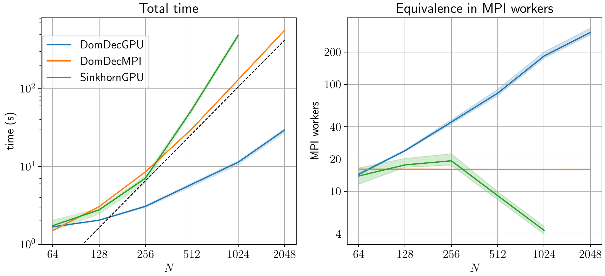

# Domain decomposition for optimal transport

This repository provides both MPI and GPU mulsticale implementations of the domain decomposition algorithm for entropic optimal transport, following respectively [[1]](#1) and [[2]](#2). A comparative of the performance of both implementations against a multiscale GPU Sinkhorn implementation is shown below. 



## Requisites

For the MPI implementation an MPI library is required. We tested our algorithm against `openmpi`.

For the GPU algorithms it is necessary to install the [`LogSinkhornGPU`](https://github.com/OTGroupGoe/LogSinkhornGPU) library. 

```bash
pip install git+https://github.com/OTGroupGoe/LogSinkhornGPU
```

## Examples

The folder `examples` contains examples for the MPI and GPU implementation. An example using a multiscale GPU Sinkhorn is also provided for reference. The GPU scripts can be run just by invoking the python interpreter

```bash
python example-domdec-gpu.py
```

For the MPI implementation one needs to invoke the MPI binaries. For example, for running with `openmpi` and 4 workers: 

```bash
mpiexec -n 5 python example-domdec-mpi.py
```
Depending on your configuration, you may need to use the `--oversubscribe` flag.

All the parameters that are set in the scripts can be overriden in the command line. For example, the following runs a larger problem (provided in `examples/data/`) with a larger tolerance:

```bash
python example-sinkhorn-gpu.py --setup_fn1 data/f-000-1024.pickle --setup_fn2 data/f-001-1024.pickle --sinkhorn_error 0.001
```


## References
<a id="1">[1]</a> 
Mauro Bonafini and Bernhard Schmitzer. *Domain decomposition for entropy  regularized optimal transport*. Numerische Mathematik, 149:819–870, 2021.

<a id="2">[2]</a>
Ismael Medina and Bernhard Schmitzer. *Flow updates for more efficient domain decomposition in entropic optimal transport*. arXiv:**TODO**, 2024.
